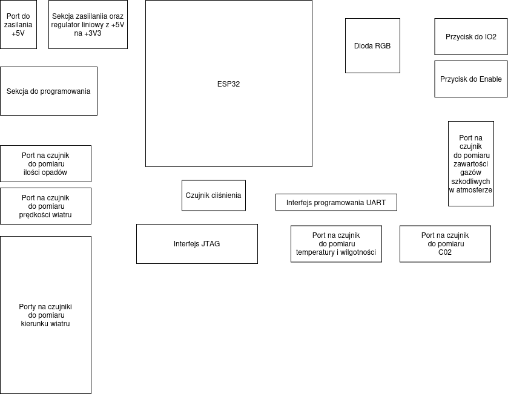
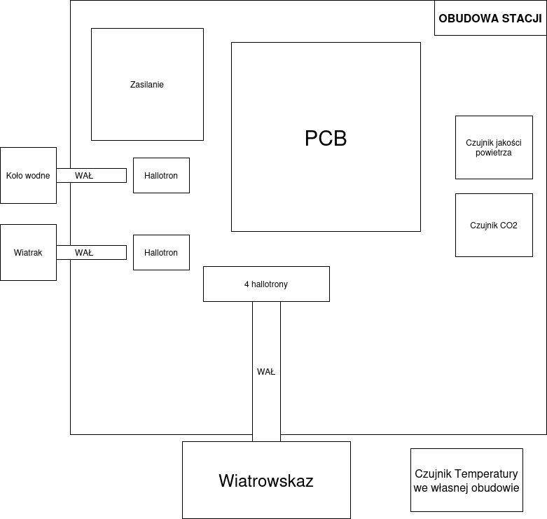

    Stacja pogodowa

## Wstęp
Tematem tego projektu jest stacja pogodowa, która zbiera informację odnośnie warunków atmosferycznych i na ich podstawie wysyła dane na oficjalną stronę koła naukowego ONYKS. Stacja ta, mierzy takie wielkości jak poziom CO2, temperaturę, prędkość wiatru, wilgotność itp. (o tym dalej).

## Założenia - jak to ma działać
Dane zbierane są za pomocą odpowiednich czujników a następnie przetwarzane przez mikrokontroler ESP32 - w tym projekcie użyto ESP32-WROOM-32D. Po przetworzeniu dane będą wysyłane na serwer przy użyciu WIFI, a następnie wyświetlane w odpowiedniej rubryce na głównej stronie koła naukowego ONYKS. Planowany rozmiar PCB ***100 mm x 82 mm***.

## Pomiary 

- Pomiar prędkości wiatru - polega na zmierzeniu prędkości obrotowej wału z magnesem, który jest obracany przy użyciu wiatraka. Pomiar ten będzie wykonywany za pomocą **Hallotronu** (czyli na przykład pomiar częstotliwości umownej "1" na czujniku i na podstawie tego określenie prędkości).

- Pomiar ilości opadów - wykonywany w podobny sposób co pomiar prędkości wiatru, z tą różnicą, że wałem kręcą łopatki, o konkretnej objętości. Takie koło wodne wporowadzane jest w ruch kiedy dana łopatka jest wypełniona. Obroty wału z magnesem są szczytywane za pomocą **Hallotronu**. 

- Pomiar kierunku wiatru - odbywa się również za pomocą 4 **Hallotronów** i wału obracanego wiatrowskazem. Tym razem aktywne czujniki wskazują kierunek. Do wskazania będzie 8 kierunków (na przykład pólnoc, południowy wschód itd.).

- Pomiar temperatury oraz wilgotności powietrza - odczytywane dane są z czujnika **DHT22**, który jest zamontowany w obudowie na zewnątrz stacji.

- Pomiar stężenia C02 w atmosferze - odbywa się za pomocą czujnika **SEN0219** znajdującego się bezpośrednio na PCB.

- Pomiar jakości powietrza - polega zastosowaniu czujnika **MQ135**, który jest czuły na Amoniak, gazy Siarczku, opary spowodowane spalaniem Benzenu, oraz potrafi wykrywać dym i innego rodzaju szkodliwe gazy. W czystym powietrzu czujnik ten ma niską przewodność, rośnie wraz z pojawieniem się w atmosferze substancji szkodliwych

## Obudowy oraz elementy mechaniczne

- Obudowy, będą zaprojektowane w oprogramowaniu CAD a następnie wyprodukowane za pomocą druku 3D. 

- Wały i łożyska będą kupowane w sklepie modelarskim np. *https://sklep.modelarnia.pl/*, lub budowalnym takim jak OBI czy CASTORAMA.

- Wiatrak i koło wodne będą zaprojektowane w oprogramowaniu CAD, a następnie drukowane.

- Do **Hallotronów** będą użyte drobne magnesy Neodymowe

## Schematy blokowe

###  Położenie elementów na płytce drukowanej :

###  Ogólny schemat ideowy układu :

## Link do rozpiski z elementami
Tutaj stworzony jest wykaz elementów potrzebnych do złożenia danej stacji : 
https://docs.google.com/spreadsheets/d/16E9U7lwzSHfPhs8wRjM2mrblf8zyNPCpttjlwKn6Azs/edit?usp=sharing

